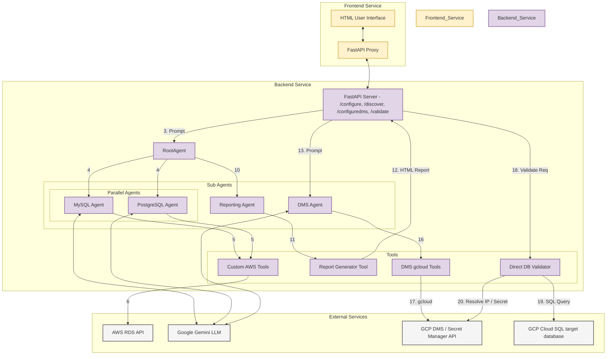

```mermaid
graph TB
    %% === Subgraphs & Nodes Definition ===
    subgraph "Frontend Service"
        style Frontend_Service fill:#FFF2CC,stroke:#D6B656,stroke-width:2px,color:#333
        UI["HTML User Interface"]
        FE_Proxy["FastAPI Proxy"]
    end

    subgraph "Backend Service"
        style Backend_Service fill:#E1D5E7,stroke:#9673A6,stroke-width:2px,color:#333
        BE_Server["FastAPI Server - /configure, /discover, /configuredms, /validate"]
        RootAgent["RootAgent"]
        subgraph "Sub Agents"
            subgraph "Parallel Agents"
                MysqlAgent["MySQL Agent"]
                PostgresAgent["PostgreSQL Agent"]
            end
            ReportAgent["Reporting Agent"]
            DmsAgent["DMS Agent"]
        end
        subgraph "Tools"
            CustomTools["Custom AWS Tools"]
            ReportGeneratorTool["Report Generator Tool"]
            DmsTools["DMS gcloud Tools"]
            DBValidator["Direct DB Validator"]
        end
    end

    subgraph "External Services"
        AWS["AWS RDS API"]
        LLM["Google Gemini LLM"]
        GCP_API["GCP DMS / Secret Manager API"]
        GCP_SQL["GCP Cloud SQL target database"]
    end

    %% --- Layout Enforcement: Create an invisible spine to force vertical order ---
    FE_Proxy ~~~ BE_Server
    BE_Server ~~~ LLM

    %% --- Visible Request & Response Flow ---
    UI <--> FE_Proxy
    FE_Proxy <--> BE_Server
    
    %% Discovery & Check flow:
    BE_Server -- "3. Prompt" --> RootAgent
    RootAgent -- "4" --> MysqlAgent
    RootAgent -- "4" --> PostgresAgent
    MysqlAgent -- "5" --> CustomTools
    PostgresAgent -- "5" --> CustomTools
    CustomTools -- "6" --> AWS
    MysqlAgent <--> LLM
    PostgresAgent <--> LLM
    RootAgent -- "10" --> ReportAgent
    ReportAgent -- "11" --> ReportGeneratorTool
    ReportGeneratorTool -- "12. HTML Report" --> BE_Server

    %% DMS Migration flow (/configuredms):
    BE_Server -- "13. Prompt" --> DmsAgent
    DmsAgent <--> LLM
    DmsAgent -- "16" --> DmsTools
    DmsTools -- "17. gcloud" --> GCP_API

    %% Validation flow (/validate):
    BE_Server -- "18. Validate Req" --> DBValidator
    DBValidator -- "19. SQL Query" --> GCP_SQL
    DBValidator -- "20. Resolve IP / Secret" --> GCP_API

    %% --- Styling ---
    classDef frontend fill:#FFF2CC,stroke:#D6B656,stroke-width:2px,color:#333;
    classDef backend fill:#E1D5E7,stroke:#9673A6,stroke-width:2px,color:#333;
    classDef external fill:#F5F5F5,stroke:#666,stroke-width:2px,color:#333;

    class UI,FE_Proxy,Frontend_Service frontend;
    class BE_Server,RootAgent,MysqlAgent,PostgresAgent,CustomTools,ReportAgent,ReportGeneratorTool,DmsAgent,DmsTools,DBValidator,Backend_Service backend;
    class AWS,LLM,GCP_API,GCP_SQL,External_Services external;
```