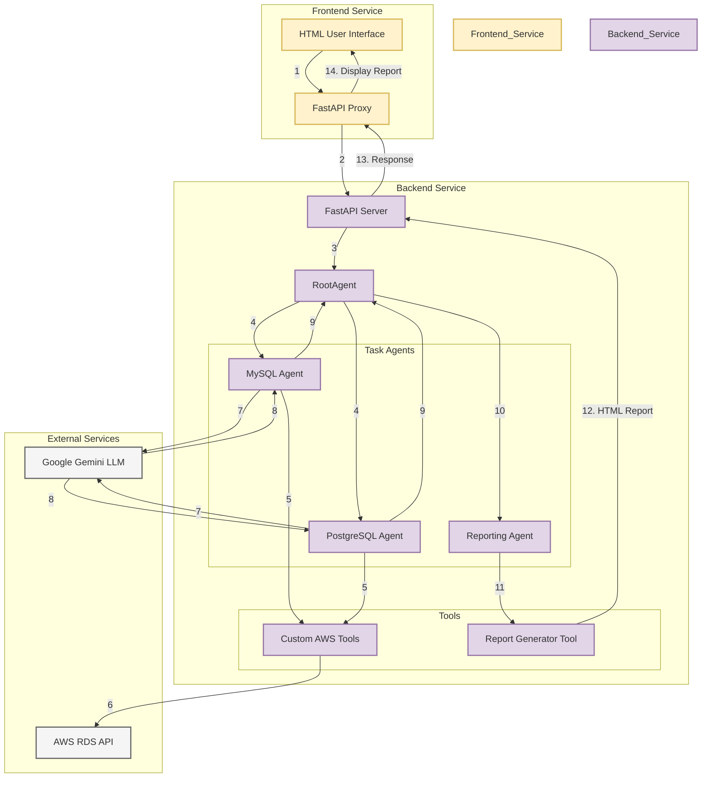

```mermaid
graph TB
    %% === Subgraphs & Nodes Definition ===
    subgraph "Frontend Service"
        style Frontend_Service fill:#FFF2CC,stroke:#D6B656,stroke-width:2px,color:#333
        UI["HTML User Interface"]
        FE_Proxy["FastAPI Proxy"]
    end

    subgraph "Backend Service"
        style Backend_Service fill:#E1D5E7,stroke:#9673A6,stroke-width:2px,color:#333
        BE_Server["FastAPI Server"]
        RootAgent["RootAgent"]
        subgraph "Task Agents"
            MysqlAgent["MySQL Agent"]
            PostgresAgent["PostgreSQL Agent"]
            ReportAgent["Reporting Agent"]
        end
        subgraph "Tools"
            CustomTools["Custom AWS Tools"]
            ReportGeneratorTool["Report Generator Tool"]
        end
    end

    subgraph "External Services"
        AWS["AWS RDS API"]
        LLM["Google Gemini LLM"]
    end

    %% --- Layout Enforcement: Create an invisible spine to force vertical order ---
    FE_Proxy ~~~ BE_Server
    BE_Server ~~~ AWS

    %% --- Visible Request & Response Flow ---
    UI -- "1" --> FE_Proxy
    FE_Proxy -- "2" --> BE_Server
    BE_Server -- "3" --> RootAgent
    RootAgent -- "4" --> MysqlAgent
    RootAgent -- "4" --> PostgresAgent
    MysqlAgent -- "5" --> CustomTools
    PostgresAgent -- "5" --> CustomTools
    CustomTools -- "6" --> AWS
    MysqlAgent -- "7" --> LLM
    PostgresAgent -- "7" --> LLM
    
    LLM -- "8" --> MysqlAgent
    LLM -- "8" --> PostgresAgent
    MysqlAgent -- "9" --> RootAgent
    PostgresAgent -- "9" --> RootAgent
    
    RootAgent -- "10" --> ReportAgent
    ReportAgent -- "11" --> ReportGeneratorTool
    
    ReportGeneratorTool -- "12. HTML Report" --> BE_Server
    BE_Server -- "13. Response" --> FE_Proxy
    FE_Proxy -- "14. Display Report" --> UI

    %% --- Styling ---
    classDef frontend fill:#FFF2CC,stroke:#D6B656,stroke-width:2px,color:#333;
    classDef backend fill:#E1D5E7,stroke:#9673A6,stroke-width:2px,color:#333;
    classDef external fill:#F5F5F5,stroke:#666,stroke-width:2px,color:#333;

    class UI,FE_Proxy,Frontend_Service frontend;
    class BE_Server,RootAgent,MysqlAgent,PostgresAgent,CustomTools,ReportAgent,ReportGeneratorTool,Backend_Service backend;
    class AWS,LLM,External_Services external;
```